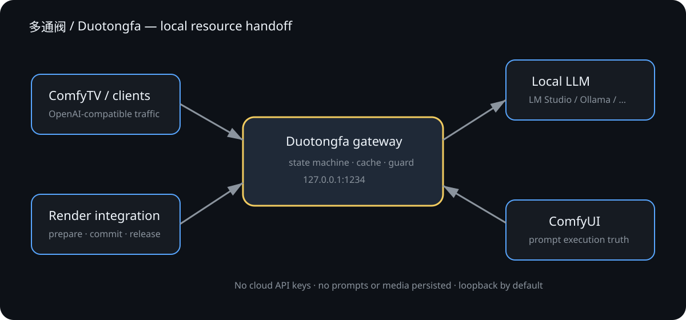

# 多通阀 / Duotongfa

[中文说明](README.zh-CN.md) · [Architecture](docs/ARCHITECTURE.md) · [Installation](docs/INSTALL.md) · [Security](SECURITY.md) · [Release privacy audit](docs/PRIVACY_AUDIT.md)

Duotongfa is a local resource handoff gateway for machines where ComfyUI and a local LLM share GPU memory or unified memory. It gives the LLM runtime and the image renderer one lifecycle coordinator, so a render starts only after the LLM has actually released resources.

Current release: **0.2.5**.



## Why it exists

On memory-constrained workstations, “stop the LLM” is often only an intention: a GUI, model refresh, health check, or worker process can keep the model resident or wake it again. The result is slow rendering, swapping, 503 errors, and workflows that stall at low progress. Duotongfa turns that informal handoff into a verifiable state machine.

## Why unloading the model during rendering can be faster

An LLM and an image-generation stack can compete for the same GPU or unified memory. Unloading the LLM before rendering can reduce memory pressure and swapping. The benefit depends on the models, runtime, and hardware.

The handoff drains LLM requests, unloads and verifies the model resources, lets ComfyUI render, and releases the lock. With the on-demand policy, the next LLM request restarts the backend when needed.

The name and control idea were inspired by multi-way thermal valves and Tesla's octovalve: several consumers share a limited resource pool, while one coordinator selects a safe route for the current workload. This is an engineering analogy only; the project is not affiliated with Tesla.

## What it does

- Proxies one OpenAI-compatible local endpoint.
- Coordinates `prepare → commit → heartbeat → release` around ComfyUI rendering.
- Blocks LLM forwarding during render, while serving a read-only model cache.
- Serializes cold model loads and model switches, with optional request limits and LM Studio loading profiles.
- Verifies backend port, processes, and memory stability before rendering.
- Watches ComfyUI `prompt_id` state and uses a watchdog only as a fallback.
- Supports LM Studio, Ollama, llama.cpp, vLLM, llama-swap, and custom local runtimes.
- Stores no API keys, prompts, images, request bodies, or Authorization headers.

It does **not** replace ComfyUI nodes, modify the ComfyTV MCP protocol, download models, or provide a cloud AI API.

## Quick start

```bash
git clone https://github.com/Pengjingyu1992/ComfyUI-Duotongfa.git
cd ComfyUI-Duotongfa
python tools/install_duotongfa.py install --start
```

Point the local OpenAI-compatible client to:

```text
http://127.0.0.1:1234/v1
```

See [the installation guide](docs/INSTALL.md) and [usage guide](docs/USAGE.md) before enabling automatic process shutdown.

## Validation status

Real hardware validation has covered one Apple Silicon macOS system using Comfy Desktop, MPS, and a local LM Studio backend. The newest application versions and other hardware configurations still require full lifecycle validation.

The portable code and installers have automated tests for macOS, Windows, and Linux. Windows/Linux hardware behavior is not claimed as verified. Compatibility reports should include redacted diagnostics and omit keys, prompts, private media, model files, and personal paths.

## Project status

Alpha. The public surface is intentionally limited to the normal local OpenAI-compatible endpoint plus one loopback control endpoint, `http://127.0.0.1:1234/__duotongfa`.

Licensed under GPL-3.0. No affiliation with ComfyUI, ComfyTV, LM Studio, Tesla, or their maintainers.
