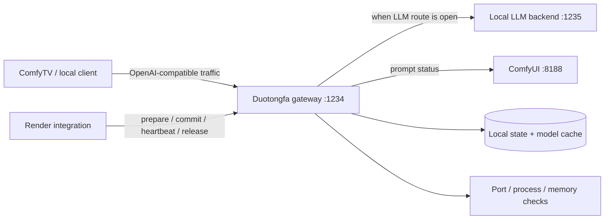

# Architecture



## State machine

```text
IDLE ──LLM request──▶ LLM_ACTIVE
LLM_ACTIVE ──render.prepare──▶ PREPARE_RENDER
PREPARE_RENDER ──port + process + memory stable──▶ RENDERING
RENDERING ──ComfyUI success/error/interrupted or release──▶ IDLE
```

Three invariants drive the implementation:

1. During a render lock, no LLM request is forwarded upstream. Model discovery may use a read-only cache.
2. ComfyUI execution state is the primary render truth; watchdog expiry is only crash recovery.
3. Process ownership is explicit. By default, the gateway stops only a process it started; takeover of an external runtime requires an opt-in setting.

The only additional control surface is the loopback endpoint `/<project>` (currently `/__duotongfa`). Canvas operations remain on ComfyTV's existing MCP interface.
